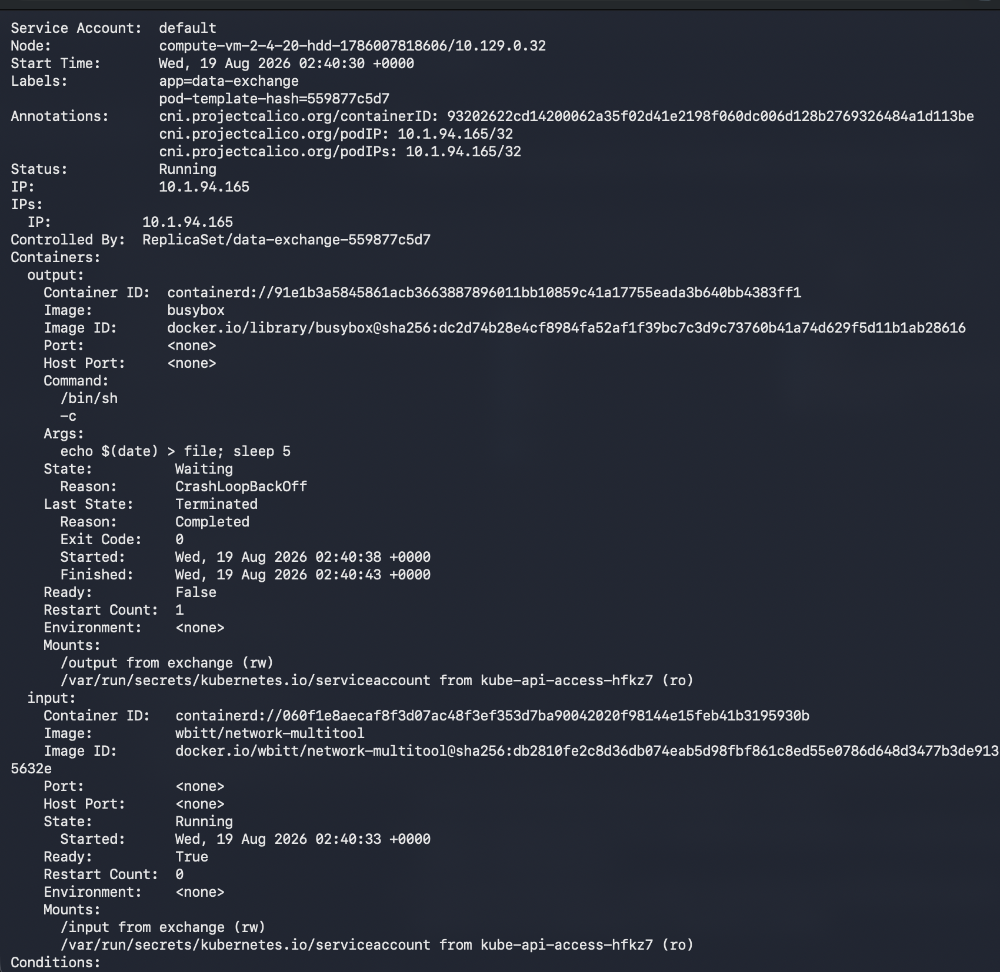
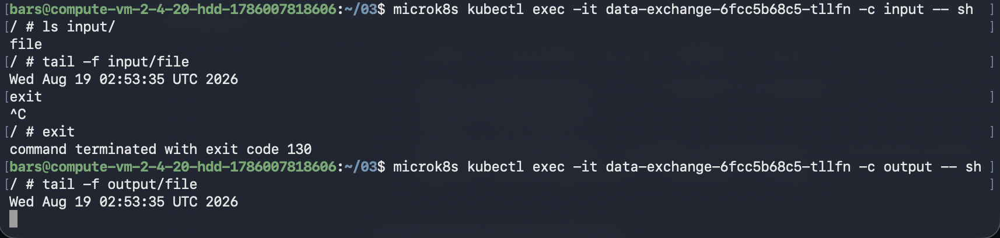
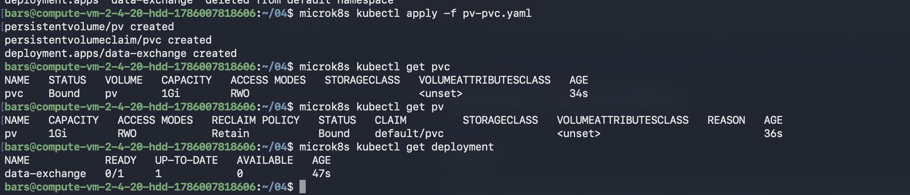
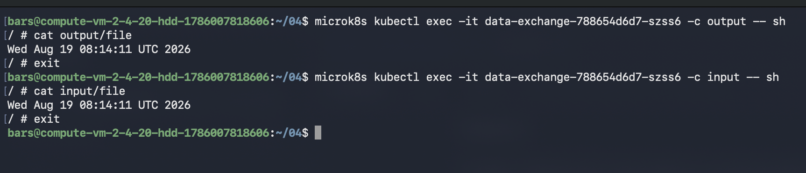
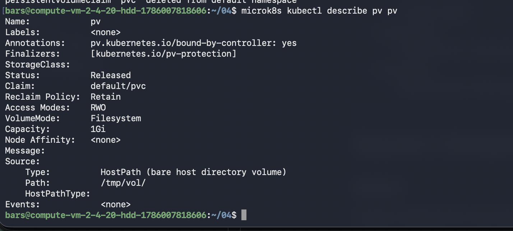
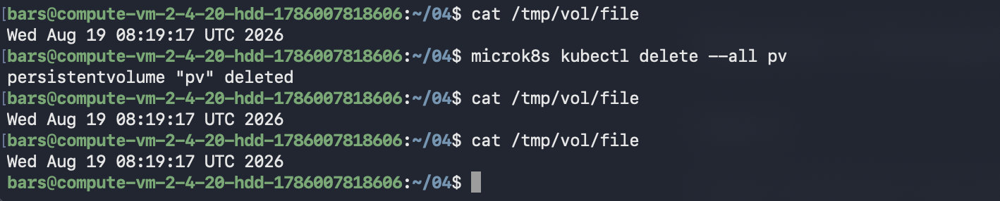
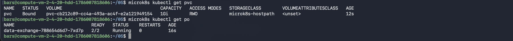
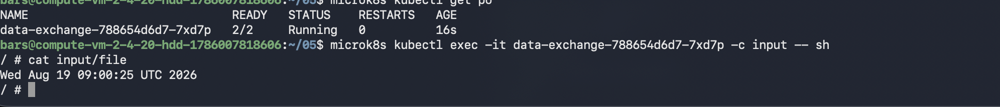

# Домашнее задание к занятию «Хранение в K8s». Ответы

#
1. 

#
2. 

PV не был затронут удалением PVC. PV является отдельной сущностью, PVC лишь ссылается на него при распределении ресурсов хранения.

Файл остался в файловой системе. PV являлось только ссылкой на фактическое хранилище и ее удаление не означает удаление данных.

#
2. 

